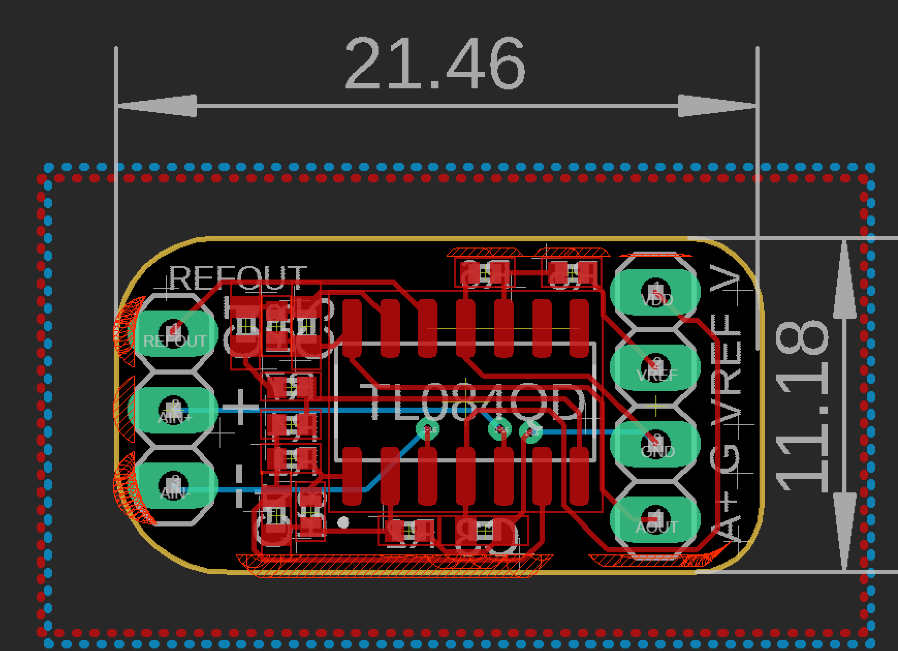
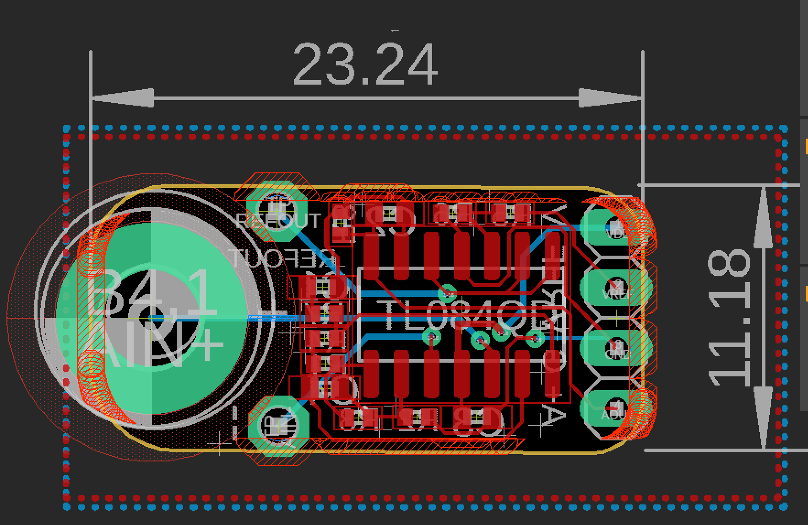
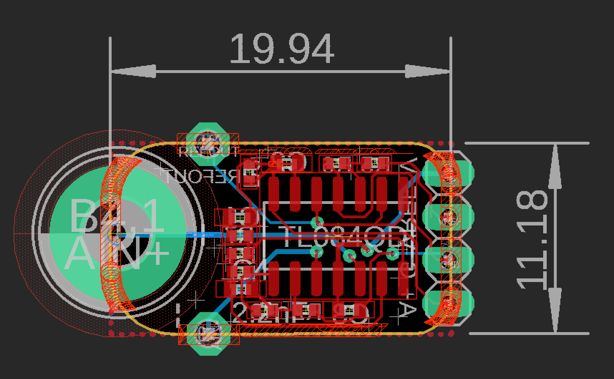
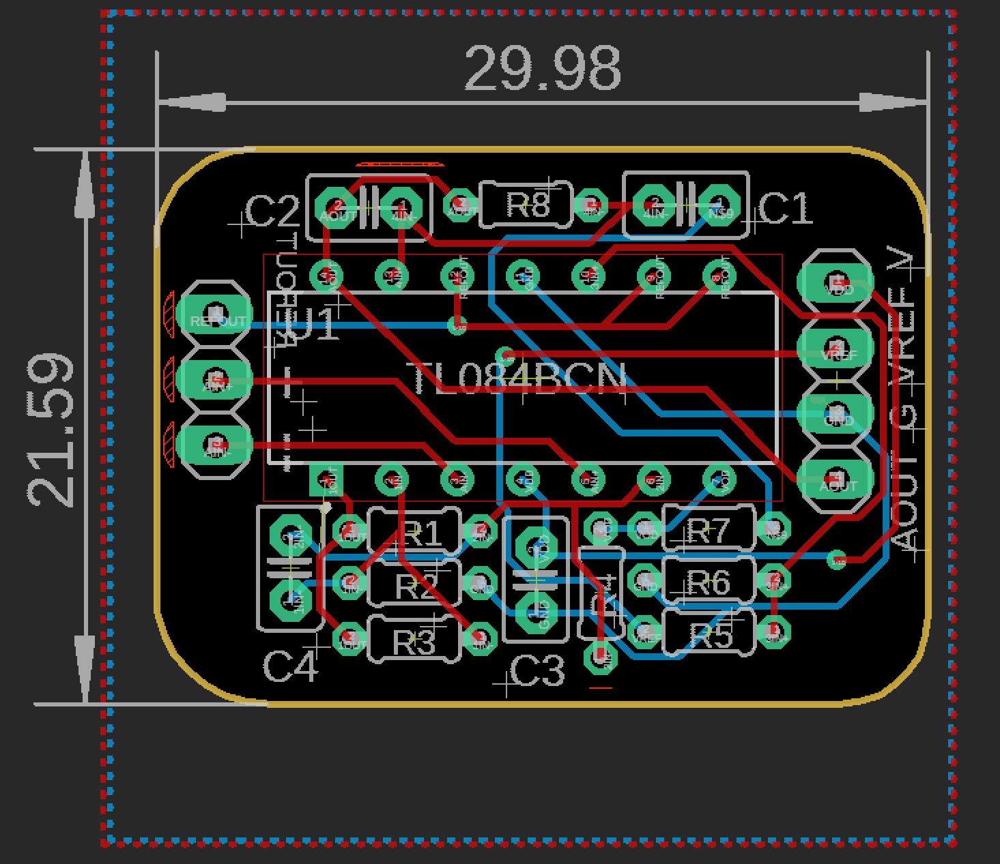
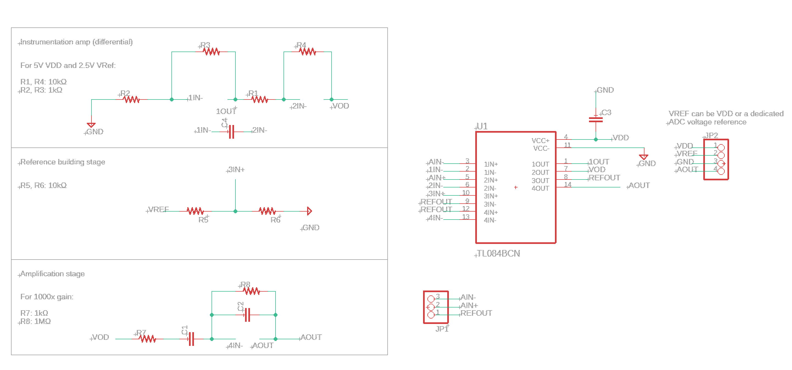
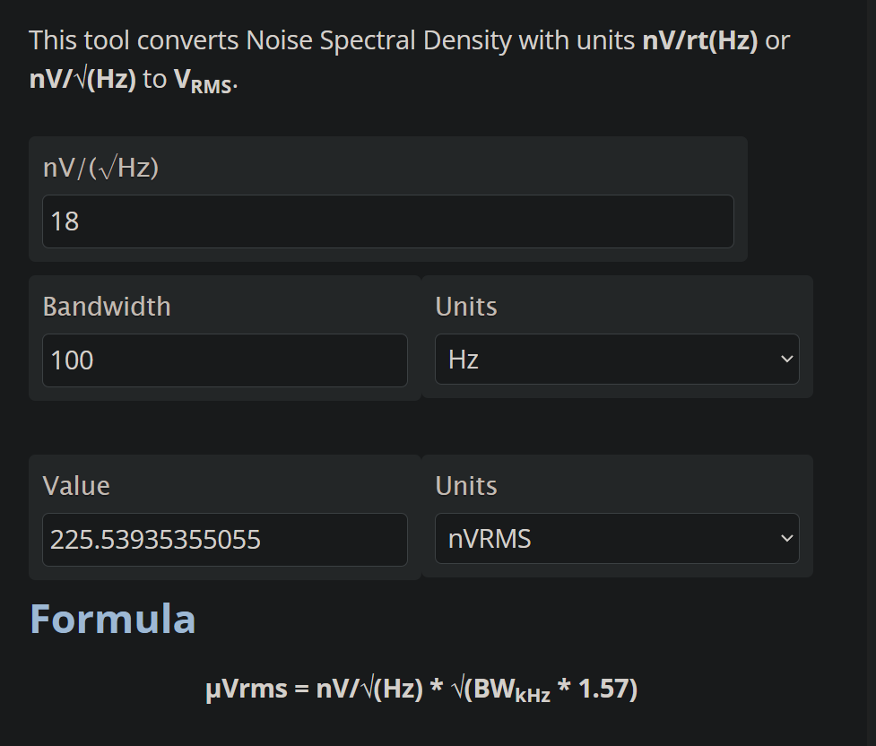

## EEG Differential Amplifier

The main circuit here uses 4 low noise op amps to achieve EEG differential amplification. This should plug into any single ended ADC (or put your negative input to ground) to allow even as low as 10 bit EEG.

The amps cost 10 cents from TI, not including the PCB which will vary.

The reference design is for 1000x gain at 5v with a 2.5v voltage reference. All calculations are in the pdf for your needs.

### Resources
- [Bill of Materials](https://docs.google.com/spreadsheets/d/1rzFOKtwm5F1gYTblCt51H4664hxHK5iFGmpR6K0Omsg/edit?usp=sharing)
- [Design reference](https://github.com/joshbrew/EEG-Amplifier/blob/main/EEG_Active_electrode_design.pdf) by Abishek Parikh. 

### TL084CDR/TL084OD (etc.) mount.

### 4mm Snap Button Electrode Mountholes

Sized for Florida Instruments reusable plastic snap electrodes.

### TL084HCN (A,B,H, etc) Thruhole amp (for DIY)

### Schematics

### Noise vs Measured Bandwidth

Note: GPT did this, might be inaccurate.

EAGLE drawings by Josh Brewster. Works in free EAGLE or you can import them elsewhere usually.

TL08XH is the latest for this design.

Free source!
