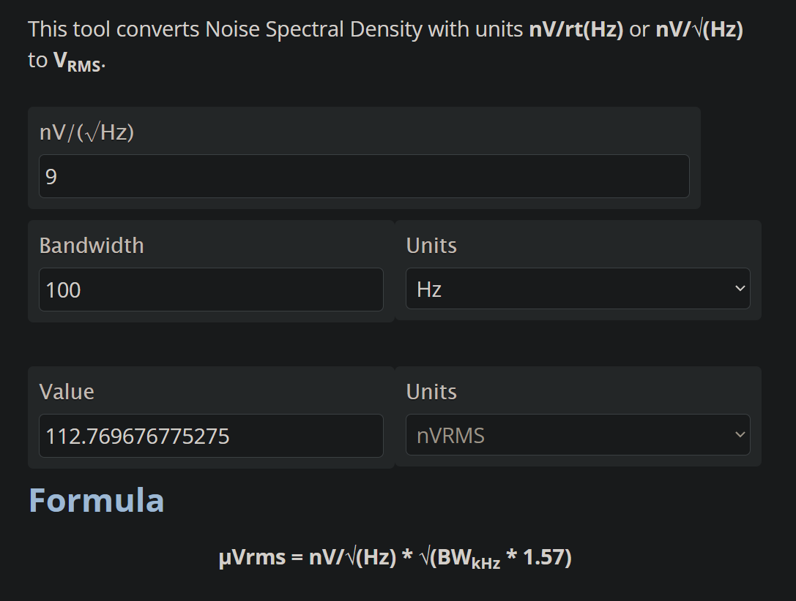

## EEG Differential Amplifier

The main circuit here uses 4 low noise op amps to achieve EEG differential amplification. This should plug into any single ended ADC (or put your negative input to ground) to allow even as low as 10 bit EEG.

The amps cost 10 cents from TI, not including the PCB which will vary.

The reference design is for 1000x gain at 5v with a 2.5v voltage reference. All calculations are in the pdf for your needs.

### Resources
- [Bill of Materials](https://docs.google.com/spreadsheets/d/1rzFOKtwm5F1gYTblCt51H4664hxHK5iFGmpR6K0Omsg/edit?usp=sharing)
- [Design reference](https://github.com/joshbrew/EEG-Amplifier/blob/main/EEG_Active_electrode_design.pdf) by Abishek Parikh. 

### TL084CDR/TL084OD/OPA4202ID (or compatible SOIC14) SMT mount.

OPA4202ID is more expensive but MUCH better quality, with better input impedance (3TΩ) and a 9nV/sqrt(Hz) noise density starting at 0.1Hz. The TL084's spectral noise doesn't bottom out until near 1kHz.

### 4mm Snap Button Electrode Mountholes

Sized for Florida Instruments reusable plastic snap electrodes.

### TL084HCN (A,B,H, etc) Thruhole amp (for DIY)

### OPA4202IPW or OPA4377 (or  compatible TSSOP14) SMT mount.

### Schematics

The BioAmp EXG Pill has a different layout you can check out. Same chipset.

### Noise vs Measured Bandwidth on OPA4202

Note: Noise calcs are probably inaccurate. Lower frequencies have higher noise density. Adjust bandpass accordingly.

TL084 noise density:

OPA4202 noise density:

OPA4202 or OPA4377 are about a dollar. I think the 4202 is better based on the noise.

## Also included in CAD/singular_amps

Single and Dual OPA202/OPA2202 gain amplifiers. E.g. for pre-amplification. Great low frequency noise density. 

EAGLE drawings by Josh Brewster. Works in free EAGLE or you can import them elsewhere usually.

TL08XH is the latest for this design.

Best prices are on TI.com just FYI...

Free source!
